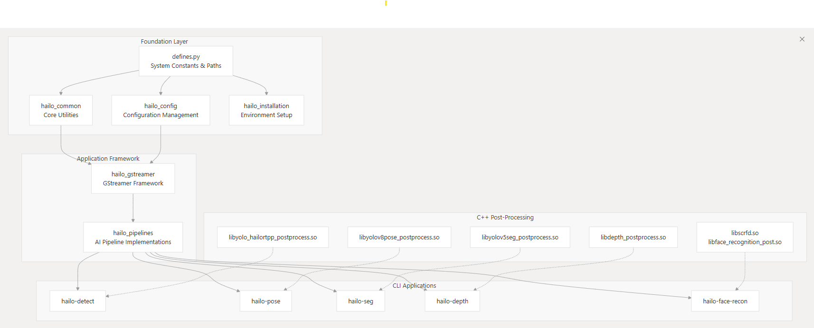

# Hailo Applications Infrastructure


The **hailo-apps-infra** repository provides foundational infrastructure and reusable components for building AI applications that leverage Hailo hardware accelerators. This toolkit makes it easy to get started with computer vision tasks using Hailo's powerful edge AI processors.

## Table of Contents

- [Hailo Applications Infrastructure](#hailo-applications-infrastructure)
  - [Table of Contents](#table-of-contents)
  - [Overview](#overview)
    - [Ready-to-Use AI Pipelines](#ready-to-use-ai-pipelines)
  - [Features](#features)
    - [Available Pipelines](#available-pipelines)
    - [Utility Commands](#utility-commands)
  - [Requirements](#requirements)
    - [System Requirements](#system-requirements)
    - [Dependencies](#dependencies)
  - [Installation](#installation)
    - [Quick Start (Automated)](#quick-start-automated)
    - [Install as Python Package](#install-as-python-package)
  - [Usage](#usage)
    - [Basic Examples](#basic-examples)
    - [Command Line Interface](#command-line-interface)
      - [Main Application Commands](#main-application-commands)
      - [Utility Commands](#utility-commands-1)
  - [Configuration](#configuration)
  - [Command Line Arguments](#command-line-arguments)
    - [Input Source Options](#input-source-options)
    - [Hardware Configuration](#hardware-configuration)
    - [Display and Performance](#display-and-performance)
    - [Development and Debugging](#development-and-debugging)
    - [Example Usage with Arguments](#example-usage-with-arguments)
  - [Project Structure](#project-structure)
  - [Testing](#testing)
  - [Contributing](#contributing)
    - [Development Setup](#development-setup)
  - [License](#license)
  - [Troubleshooting and Getting Help](#troubleshooting-and-getting-help)
    - [Common Issues You Might Encounter](#common-issues-you-might-encounter)
    - [Frame Buffer Performance Problems](#frame-buffer-performance-problems)
    - [The Dreaded DEVICE\_IN\_USE() Error](#the-dreaded-device_in_use-error)
  - [Support](#support)
    - [Getting Help](#getting-help)
    - [Reporting Issues](#reporting-issues)
    - [Additional Resources](#additional-resources)

## Overview

This repository provides essential infrastructure and pre-built AI pipelines for Hailo hardware accelerators. It supports multiple platforms including:

- **Raspberry Pi 4 and 5**
- **x86_64 Ubuntu systems** 
- **ARM-based Ubuntu systems**

### Ready-to-Use AI Pipelines

The toolkit includes optimized pipelines for common computer vision tasks:

- **Object Detection** - Identify and locate objects in images/video
- **Pose Estimation** - Detect human body keypoints and poses
- **Instance Segmentation** - Segment individual object instances
- **Face Recognition** - Detect and recognize faces
- **Depth Estimation** - Estimate depth information from 2D images

Whether you're a researcher, developer, or hobbyist, this toolkit provides everything you need to quickly deploy AI applications on Hailo hardware.

## Features

### Available Pipelines

| CLI Command | Pipeline Type | Model Architecture | Post-Processing Library |
|-------------|---------------|-------------------|------------------------|
| `hailo-detect` | Object Detection | YOLOv8m/YOLOv8s | libyolo_hailortpp_postprocess.so |
| `hailo-simple-detect` | Object Detection | YOLOv6n | libyolo_hailortpp_postprocess.so |
| `hailo-pose` | Pose Estimation | YOLOv8m_pose/YOLOv8s_pose | libyolov8pose_postprocess.so |
| `hailo-seg` | Instance Segmentation | YOLOv5m_seg/YOLOv5n_seg | libyolov5seg_postprocess.so |
| `hailo-depth` | Depth Estimation | SCDepthv3 | libdepth_postprocess.so |
| `hailo-face-recon` | Face Recognition | SCRFD + ArcFace | libscrfd.so, libface_recognition_post.so |

### Utility Commands

| CLI Command | Description |
|-------------|-------------|
| `hailo-post-install` | Run post-installation setup and configuration |
| `hailo-set-env` | Configure environment variables |
| `hailo-download-resources` | Download model files and resources |


## Requirements

### System Requirements

- **Operating System**: Linux (Ubuntu 20.04+, Raspberry Pi OS)
- **Python**: 3.10-3.11
- **Privileges**: `sudo` access for system-level installation
- **Hardware**: Hailo8L, Hailo8, or Hailo10H device

### Dependencies

The following Hailo components are required and will be installed automatically:

- **HailoRT** - Core runtime for Hailo devices
- **HailoRT PCIe Driver** - Driver for PCIe-connected devices
- **HailoRT Python Bindings** - Python interface for HailoRT
- **Hailo TAPPAS Core** - Core processing pipeline framework
- **Hailo TAPPAS Python Bindings** - Python interface for TAPPAS

## Installation

### Quick Start (Automated)

The easiest way to get started is with our automated installation script:

```bash
# Clone the repository
git clone https://github.com/hailo-ai/hailo-apps-infra.git
cd hailo-apps-infra

# Run automated installation
./install.sh

# To download all available model resources
./install.sh --all

# To use a custom virtual environment name
./install.sh --venv-name my_custom_env
```

The installation script will:
1. Create a Python virtual environment
2. Install all required dependencies
3. Download necessary model files
4. Configure the environment

### Install as Python Package

You can also install directly from GitHub as a Python package:

```bash
pip install git+https://github.com/hailo-ai/hailo-apps-infra.git

source hailo_infra_venv/bin/activate

hailo-post-install
```

For more info about installation please check out : [Installation Guide](/hailo-apps-infra/doc/installation_guide.md)
## Usage

### Basic Examples

Here are some common usage patterns: 

```bash
# Real-time object detection from webcam
hailo-detect --input usb --show-fps

# Process default video file
hailo-detect 

# Use Raspberry Pi camera for pose estimation
hailo-pose --input rpi --frame-rate 30

# Run segmentation without display sync (fastest processing)
hailo-seg --input /path/to/video.mp4 --disable-sync

# Run depth on default video
hailo-depth 
```

### Command Line Interface

After installation, you'll have access to several command-line tools:

#### Main Application Commands

```bash
# Object detection on video file
hailo-detect --input /path/to/video.mp4

# Pose estimation using USB camera
hailo-pose --input usb --show-fps

# Instance segmentation using Raspberry Pi camera
hailo-seg --input rpi

# Depth estimation with custom model
hailo-depth --input /path/to/video.mp4 --hef-path custom_model.hef

# Face recognition
hailo-face-recon --input usb
```

#### Utility Commands

```bash
# Download additional model resources
hailo-download-resources --group default

# Set up environment variables
hailo-set-env

# Run post-installation configuration
hailo-post-install
```


## Configuration

The system uses a YAML configuration file to manage settings. Here's what each configuration option controls:

```yaml
# HailoRT version configuration
hailort_version: "auto"  # Options: "auto", "latest", or specific version (e.g., "4.15.0")

# TAPPAS framework version
tappas_version: "auto"   # TAPPAS model version - "auto" for automatic detection

# Model zoo version for downloading models
model_zoo_version: "v2.14.0"  # Specific version of the Hailo model zoo

# Hardware architecture detection
host_arch: "auto"        # Options: "rpi", "x86", "arm", or "auto"
hailo_arch: "auto"       # Options: "hailo8", "hailo8l", "hailo10h", or "auto"

# File paths and directories
resources_path: "resources"              # Where to store downloaded models
virtual_env_name: "hailo_infra_venv"     # Virtual environment name
storage_dir: "hailo_temp_resources"      # Temporary storage for downloads

# Server configuration
server_url: "http://dev-public.hailo.ai/2025_01"  # Model download server

# TAPPAS configuration
tappas_variant: "auto"           # Options: "tappas", "tappas-core", or "auto"
tappas_postproc_path: "auto"     # Path to post-processing libraries
```

**Configuration Tips:**
- Keep `"auto"` settings for automatic hardware detection
- Only modify `resources_path` if you need models in a specific location
- The `server_url` should not be changed unless directed by Hailo support

## Command Line Arguments

All pipeline commands support these common arguments:

### Input Source Options
```bash
--input, -i <source>    # Input source options:
                        #   rpi          - Raspberry Pi camera
                        #   usb          - Auto-detect USB camera
                        #   /dev/video0  - Specific camera device
                        #   video.mp4    - Video file
```

### Hardware Configuration
```bash
--arch <architecture>   # Specify Hailo device: hailo8, hailo8l, hailo10h
--hef-path <path>      # Path to custom HEF model file
```

### Display and Performance
```bash
--show-fps, -f         # Display FPS counter on output
--frame-rate, -r <fps> # Set input frame rate (default: 30)
--disable-sync         # Run at maximum speed (no display sync)
--disable-callback     # Skip custom callback functions
```

### Development and Debugging
```bash
--use-frame, -u        # Use frame from callback function
--dump-dot             # Generate pipeline graph (pipeline.dot)
--labels-json <path>   # Path to custom labels JSON file
```

### Example Usage with Arguments

```bash
# High-performance object detection with custom model
hailo-detect --input usb --arch hailo8 --show-fps --disable-sync

# Pose estimation with custom frame rate
hailo-pose --input rpi --frame-rate 60 --labels-json custom_labels.json

# Debug pipeline with graph output
hailo-seg --input video.mp4 --dump-dot --use-frame
```

## Project Structure




```
hailo-apps-infra/
├── hailo_apps_infra/
│   ├── hailo_core/                 # Core infrastructure
│   │   ├── hailo_common/           # Common utilities and shared code
│   │   ├── hailo_config/           # Configuration management
│   │   └── hailo_installation/     # Installation and setup utilities
│   ├── hailo_apps/                 # Application pipelines and apps
│   │   ├── apps/                   # Complete applications
│   │   │   └── face_recognition/   # Face recognition application
│   │   ├── hailo_gstreamer/        # GStreamer pipeline components
│   │   └── hailo_pipelines/        # Pre-built AI pipelines
│   └── hailo_cpp_postprocess/      # C++ post-processing libraries
│       ├── build.release/          # Compiled libraries and build artifacts
│       │   └── cpp/                # Built post-processing .so files
│       ├── cpp/                    # C++ source code
│       └── resources/              # Post-processing resources
│           └── so/                 # Shared object libraries
├── doc/                            # Documentation and images
│   └── images/                     # Documentation images
├── scripts/                        # Installation and utility scripts
├── tests/                          # Test suite
│   └── test_resources/             # Test data and resources
├── local_resources/                # Local resource storage
├── install.sh                      # Main installation script
├── requirements.txt                # Python dependencies
└── pyproject.toml                       # Package configuration
```

## Testing

Run the comprehensive test suite to verify your installation:

```bash
# Run all tests
pytest tests/

# Run specific test categories
pytest tests/test_installation.py -v
pytest tests/test_pipelines.py -v

# Use the provided test script
./run_tests.sh
```

The test suite covers:
- Installation verification
- Pipeline functionality
- Hardware compatibility
- Configuration validation

## Contributing

We welcome contributions! Here's how to get started:

1. **Fork the repository** on GitHub
2. **Create a feature branch**: `git checkout -b feature-name`
3. **Make your changes** and add tests
4. **Run the test suite**: `pytest tests/`
5. **Submit a pull request** with a clear description

### Development Setup

```bash
# Clone your fork
git clone https://github.com/your-username/hailo-apps-infra.git
cd hailo-apps-infra

# Install in development mode
pip install -e .

# Install development dependencies
pip install pytest black flake8
```

For detailed development guidelines, check out our Development Guide.

## License

This project is licensed under the MIT License - see the [LICENSE](LICENSE) file for complete details.

## Troubleshooting and Getting Help

If you run into problems, head over to the [Hailo Community Forum](https://community.hailo.ai/) and open a ticket. The forum is packed with helpful information and solutions from other users who've likely faced similar issues.

### Common Issues You Might Encounter

### Frame Buffer Performance Problems
Some models are simply too demanding to run at 30FPS. When this happens, you'll need to dial back the frame rate using the `--set-fps` flag to get smooth performance.

### The Dreaded DEVICE_IN_USE() Error
This error pops up when the Hailo device (typically `/dev/hailo0`) is already being used by another process or got stuck from a previous session that didn't shut down properly.

**Quick Fix:**
The easiest solution is to run our cleanup script:
```bash
../scripts/kill_first_hailo.sh
```

**Manual Fix (For the Curious):**
If you want to understand what's happening under the hood, here's how to troubleshoot it yourself:

1. **Double-check your device path** - Make sure `/dev/hailo0` is actually your Hailo device (it usually is, but worth confirming).

2. **Find the culprit process** - Use this command to see what's hogging your device:
   ```bash
   sudo lsof /dev/hailo0
   ```
   This will show you exactly which processes are using the device and their Process IDs (PIDs).

3. **Kill the blocking process** - Once you have the PID, terminate it with:
   ```bash
   sudo kill -9 <PID>
   ```
   Just replace `<PID>` with the actual process ID from step 2.

That should free up your Hailo device and get you back to running your models smoothly!


## Support

### Getting Help

- **Primary Support**: [Hailo Community Forum](https://community.hailo.ai/) - Ask questions, share experiences, and get community support
- **Developer Resources**: Visit the [Hailo Website](https://hailo.ai/) for additional documentation and resources
- **Downloads**: Access .deb and .whl files through the Developer Zone on the Hailo website

### Reporting Issues

If you encounter problems:

1. Search existing discussions on the [Hailo Community Forum](https://community.hailo.ai/)
2. Create a new topic in the appropriate forum category with:
   - Hailo device type
   - Error messages and logs
   - Steps to reproduce the issue

### Additional Resources

- **Official Documentation**: Available on the Hailo website
- **Model Files**: Download additional models from the Developer Zone
- **Hardware Drivers**: Get the latest drivers from the Developer Zone

---

*Happy coding with Hailo! 🚀*