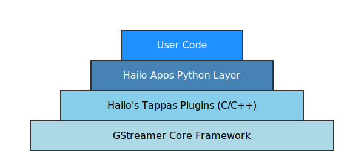
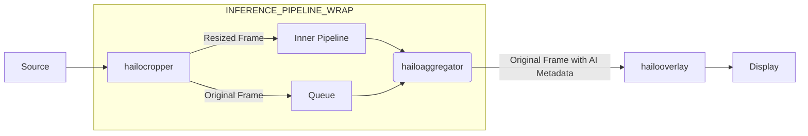
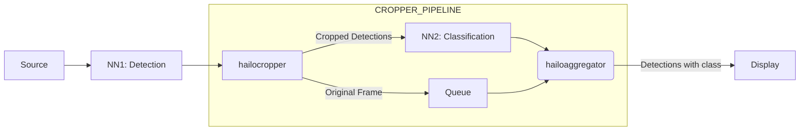
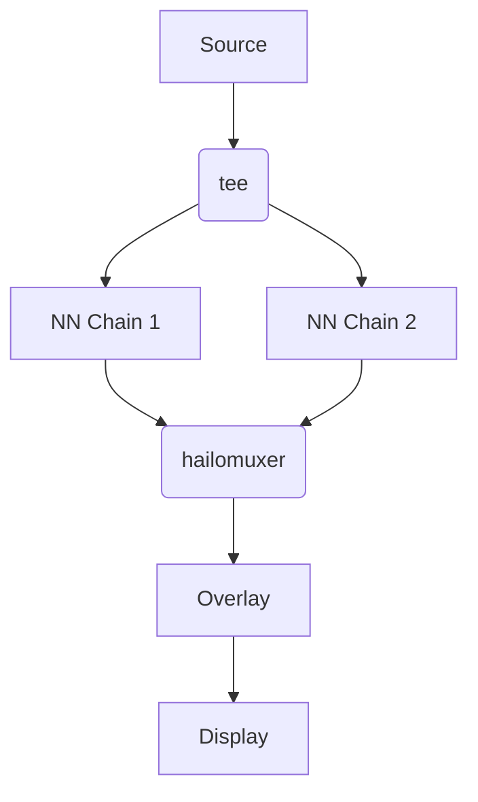
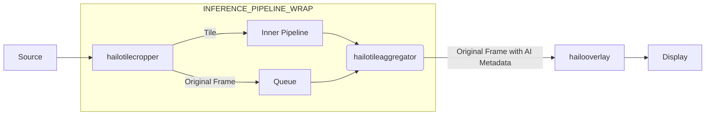

# Hailo Application Development Guide

This guide provides a comprehensive overview of how to develop AI applications using the Hailo GStreamer framework. It covers the underlying architecture and two primary development paths: basic callback customization and advanced pipeline modification.

## The Technology Stack: A Layered Architecture

Our framework is built on a stack of technologies, from the open-source GStreamer foundation to our custom Python tools. The diagram below illustrates how these layers build upon one another, with each layer providing a higher level of abstraction.



This diagram visually represents our technology stack. Understanding this stack is key to effective development.

### Level 1: The GStreamer Framework
At the base of our stack is **GStreamer**, a powerful open-source framework for creating streaming media applications. It provides a plugin-based architecture where elements are linked together to form a pipeline that defines a data flow. For more information, you can visit the [GStreamer official documentation](https://gstreamer.freedesktop.org/documentation/).

### Level 2: Hailo's Tappas C/C++ GStreamer Plugins
On top of GStreamer, we use **Hailo's Tappas** plugins. This is a library of C/C++ GStreamer elements specifically designed to interface with the Hailo AI accelerator. These high-performance elements are the bridge between the GStreamer framework and the Hailo hardware.

#### Core Tappas GStreamer Elements
The framework provides many specialized GStreamer elements.

<details>
<summary><strong>Click to see the list of Core Tappas Elements</strong></summary>

*   **AI/ML Processing Elements**
    *   **[HailoNet](https://github.com/hailo-ai/tappas/blob/master/docs/elements/hailo_net.rst)**: The core inference element. It receives video frames, sends them to the Hailo hardware, and outputs the raw inference results. (This element is relased as part of HailoRT)
    *   **[HailoFilter](https://github.com/hailo-ai/tappas/blob/master/docs/elements/hailo_filter.rst)**: Applies C++ post-processing functions to the raw output from `HailoNet`, converting it into structured data like detection objects.
    *   **[HailoOverlay](https://github.com/hailo-ai/tappas/blob/master/docs/elements/hailo_overlay.rst)**: Draws the structured AI metadata (bounding boxes, masks, labels) onto the video frames for visualization.

*   **Multi-Device & Routing Elements**
    *   **[HailoMuxer](https://github.com/hailo-ai/tappas/blob/master/docs/elements/hailo_muxer.rst)**: Muxer element for Multi-Hailo-8 setups.
    *   **[HailoRoundRobin](https://github.com/hailo-ai/tappas/blob/master/docs/elements/hailo_roundrobin.rst)**: Provides muxing functionality in a round-robin method.
    *   **[HailoStreamRouter](https://github.com/hailo-ai/tappas/blob/master/docs/elements/hailo_stream_router.rst)**: Provides de-muxing functionality.

*   **Cascading Networks Elements**
    *   **[HailoCropper](https://github.com/hailo-ai/tappas/blob/master/docs/elements/hailo_cropper.rst)**: Designed for cascading networks with 1 sink and 2 sources.
    *   **[HailoAggregator](https://github.com/hailo-ai/tappas/blob/master/docs/elements/hailo_aggregator.rst)**: Designed for cascading networks with 2 sink pads and 1 source.

*   **Tiling Elements**
    *   **[HailoTileCropper](https://github.com/hailo-ai/tappas/blob/master/docs/elements/hailo_tile_cropper.rst)**: Designed for tiled applications with 1 sink and 2 sources.
    *   **[HailoTileAggregator](https://github.com/hailo-ai/tappas/blob/master/docs/elements/hailo_tile_aggregator.rst)**: Designed for tiled applications with 2 sink pads and 1 source.

*   **Tracking & Monitoring Elements**
    *   **[HailoTracker](https://github.com/hailo-ai/tappas/blob/master/docs/elements/hailo_tracker.rst)**: Applies Joint Detection and Embedding (JDE) with Kalman filtering for object tracking.
    *   **[HailoDeviceStats](https://github.com/hailo-ai/tappas/blob/master/docs/elements/hailo_device_stats.rst)**: Samples power and temperature from Hailo devices.

</details>

### Level 3: Hailo Apps Python Layer
This layer is developed in this repository to simplify the process of building and running applications on top of the GStreamer and TAPPAS foundation. It consists of three main components:
*   **The Application Runner (`gstreamer_app.py`)**: This component features the `GStreamerApp` class, which serves as the core engine of the application. It is responsible for managing the pipeline's lifecycle, handling bus messages (such as errors or End-Of-Stream), and integrating your Python callback functions.
*   **The Pipeline Factory (`gstreamer_helper_pipelines.py`)**: This module provides a set of Python functions that facilitate the creation of GStreamer pipeline strings in a modular and easily understandable manner.
*   **Hailo Pipelines**: These are pre-configured, ready-to-use AI pipelines that leverage the helper functions from the factory to form complete, executable applications for common scenarios like object detection or pose estimation. You can connect to their outputs with a simple callback, allowing you to easily integrate custom logic or processing steps.

## Development Path 1: Basic (Callback-based)

This is the fastest way to build an application. The core idea is to start from one of our pre-built examples and inject your custom logic by writing a simple Python callback function. Each pipeline is designed to be runnable with a simple callback.

We recommend copying one of our example applications, like `hailo_apps/hailo_app_python/apps/detection/detection.py`, as your starting point.

### The User Application Workflow

A user application script typically has three parts: an optional custom data class, a callback function, and a main execution block.

#### 1. (Optional) Create a Custom Data Class
To maintain state between callback calls (e.g., counting frames or objects), you can create a class that inherits from `app_callback_class`. This object is passed to every invocation of your callback.

```python
from hailo_apps_infra.hailo_rpi_common import app_callback_class

class user_app_callback_class(app_callback_class):
    def __init__(self):
        super().__init__()
        self.total_person_count = 0

    def increment_person_count(self, count):
        self.total_person_count += count
```

#### 2. Implement the Callback Function
This is where your custom logic lives. The function receives the raw GStreamer buffer, from which you can extract the AI metadata (`HailoROI`).

```python
import hailo

def app_callback(pad, info, user_data):
    # Get the processed data from the buffer
    roi = hailo.get_roi_from_buffer(info.get_buffer())

    # Get all detection objects from the HailoROI
    detections = roi.get_objects_typed(hailo.HAILO_DETECTION)

    person_count = 0
    for detection in detections:
        if detection.get_label() == "person":
            person_count += 1
            print(f"Found a person with confidence {detection.get_confidence():.2f}")

    # Use the custom data class to update the total count
    if person_count > 0:
        user_data.increment_person_count(person_count)

    # The function must return Gst.PadProbeReturn.OK
    return Gst.PadProbeReturn.OK
```

#### 3. Write the Main Execution Block
The main block ties everything together. You import a pre-built application pipeline (like `GStreamerDetectionApp`), instantiate your custom data class, and pass them along with your callback function to the application constructor before calling `.run()`.

```python
if __name__ == "__main__":
    # Import the pre-built pipeline application
    from hailo_apps_infra.detection_pipeline import GStreamerDetectionApp

    # Create an instance of your custom data class
    user_data = user_app_callback_class()

    # Pass your callback and data class to the pre-built application
    app = GStreamerDetectionApp(app_callback, user_data)
    app.run()
```

### How to Run Your Application
To run your application, you simply execute your Python script from the terminal. The application will automatically handle command-line arguments for inputs, HEF files, and other parameters.
For example:
```bash
python hailo_apps/hailo_app_python/apps/detection/detection.py --input </path/to/your/video.mp4>
```

### The Callback Mechanism Explained
The GStreamer pipeline handles all the heavy lifting (video decoding, inference, rendering). When it has new AI metadata available, it triggers your Python **callback** function.

1.  **Data Production**: The pipeline processes a video frame, and the C++ post-processing library creates structured `HailoROI` metadata (containing detections, landmarks, etc.).
2.  **Callback Invocation**: An `identity` element in the pipeline intercepts the GStreamer buffer and triggers your Python function, passing the `HailoROI` object to it.
3.  **Your Custom Logic**: Inside your callback, you parse the `HailoROI` and perform any action you need.

> **IMPORTANT**: The callback function must be non-blocking. Long-running tasks must be dispatched to a separate thread or process to avoid stalling the video pipeline.


---

## Development Path 2: Advanced (Pipeline Modification)

You can build your own pipelines from scratch or modify our examples to suit different data flow requirements.

### How to Build a Custom Pipeline
Building a custom pipeline involves creating a Python class that inherits from our `GStreamerApp` base class. This approach allows you to leverage the core application logic (like window management and bus handling) while defining your own unique pipeline structure.

The process is straightforward:

1.  **Create a Class Inheriting from `GStreamerApp`**: Your application will be a new class that extends `GStreamerApp`. In the constructor (`__init__`), you'll call the parent constructor and set up any application-specific parameters, such as HEF paths, video sources, or model thresholds.

2.  **Override the `get_pipeline_string` Method**: This is where you define your GStreamer pipeline. You must implement this method in your class. Inside, you'll use the helper functions from `gstreamer_helper_pipelines.py` (like `SOURCE_PIPELINE`, `INFERENCE_PIPELINE`, etc.) to build the pipeline string piece by piece.

3.  **Run Your Application**: In your main execution block, you instantiate your new class and call its `run()` method, which handles the pipeline setup and execution.

### Example: Building a Simple Detection Pipeline

Here is a simplified example based on `detection_pipeline_simple.py` that illustrates the concept:

```python
# Import necessary classes and pipeline helpers
from hailo_apps.hailo_gstreamer.gstreamer_app import GStreamerApp
from hailo_apps.hailo_gstreamer.gstreamer_helper_pipelines import (
    SOURCE_PIPELINE, INFERENCE_PIPELINE, DISPLAY_PIPELINE
)

# 1. Create a class that inherits from GStreamerApp
class GStreamerDetectionApp(GStreamerApp):
    def __init__(self, args, user_data):
        # Call the parent constructor
        super().__init__(args, user_data)

        # Set up application-specific properties
        self.hef_path = "path/to/your/model.hef"
        self.post_process_so = "path/to/your/postprocess.so"
        # ... other parameters

    # 2. Override this method to define your pipeline
    def get_pipeline_string(self):
        # Use helper functions to build the pipeline components
        source = SOURCE_PIPELINE(video_source=self.video_source, ...)
        infer = INFERENCE_PIPELINE(hef_path=self.hef_path, ...)
        display = DISPLAY_PIPELINE(...)

        # Link the components together with '!'
        pipeline_string = f"{source} ! {infer} ! {display}"
        print(pipeline_string)
        return pipeline_string

# 3. Run the application
if __name__ == "__main__":
    # app_callback and user_data are for the basic path; can be simple for this case
    app = GStreamerDetectionApp(app_callback=dummy_callback, user_data=app_callback_class())
    app.run()
```
You have full control to reorder, remove, or add new GStreamer elements in the string returned by `get_pipeline_string` to create your desired data flow.

### Common Architectural Patterns
The following patterns are examples for commonly used pipeline architectures. Most common patterns are already implemented in the GStreamerHelperPipelines.
It is highly recommended to use the helper functions to build your pipeline, but you can also build your own pipeline string from scratch.

#### 1. Single Network Pipeline
**Use case:** Run a single AI model (e.g., object detection) on a video stream.


A high level code example for building this pipeline using the helper functions:
```python
from hailo_apps.hailo_gstreamer.gstreamer_helper_pipelines import (
    SOURCE_PIPELINE, INFERENCE_PIPELINE, DISPLAY_PIPELINE
)

pipeline_string = (
    f"{SOURCE_PIPELINE(video_source='input.mp4')} ! "
    f"{INFERENCE_PIPELINE(hef_path='model.hef', post_process_so='post.so')} ! "
    f"{DISPLAY_PIPELINE()}"
)
```

#### 2. Wrapped Inference for Resolution Preservation
**Use case:** Run inference on a scaled-down version of the video for performance, but display the original high-res video with overlays.



A high level code example for building this pipeline using the helper functions:
```python
from hailo_apps.hailo_gstreamer.gstreamer_helper_pipelines import (
    SOURCE_PIPELINE, INFERENCE_PIPELINE, INFERENCE_PIPELINE_WRAPPER, DISPLAY_PIPELINE
)

inner_infer = INFERENCE_PIPELINE(hef_path='model.hef', post_process_so='post.so')
inner_infer_wrapper = INFERENCE_PIPELINE_WRAPPER(inner_infer)
pipeline_string = (
    f"{SOURCE_PIPELINE(video_source='input.mp4')} ! "
    f"{inner_infer_wrapper} ! "
    f"{DISPLAY_PIPELINE()}"
)
```


#### 3. Cascaded Networks Pipeline
**Use case:** Run two or more models in series (e.g., detection followed by classification on detected regions).



A high level code example for building this pipeline using the helper functions.
Note that the `CROPPER_PIPELINE` is a helper function that is used to crop the detections from the first network and pass them to the second network. You can control the cropper by passing a custom C++ function to it.

```python
from hailo_apps.hailo_gstreamer.gstreamer_helper_pipelines import (
    SOURCE_PIPELINE, INFERENCE_PIPELINE, CROPPER_PIPELINE, DISPLAY_PIPELINE
)

first_infer = INFERENCE_PIPELINE(hef_path='detector.hef', post_process_so='detector_post.so')
second_infer = INFERENCE_PIPELINE(hef_path='classifier.hef', post_process_so='classifier_post.so')
cropper = CROPPER_PIPELINE(second_infer, so_path='cropper.so', function_name='crop_func')
pipeline_string = (
    f"{SOURCE_PIPELINE(video_source='input.mp4')} ! "
    f"{first_infer} ! {cropper} ! {DISPLAY_PIPELINE()}"
)
```

#### 4. Parallel Networks Pipeline
**Use case:** Run multiple models in parallel on the same input stream and combine their results.



A high level code example for building this pipeline using the helper functions.

```python
from hailo_apps.hailo_gstreamer.gstreamer_helper_pipelines import (
    SOURCE_PIPELINE, INFERENCE_PIPELINE, DISPLAY_PIPELINE
)

pipeline_string = (
    f"{SOURCE_PIPELINE(video_source='input.mp4')} ! tee name=t "
    f"t. ! {INFERENCE_PIPELINE(hef_path='model1.hef', post_process_so='post1.so')} ! hailomuxer name=m "
    f"t. ! {INFERENCE_PIPELINE(hef_path='model2.hef', post_process_so='post2.so')} ! m. "
    f"m. ! {DISPLAY_PIPELINE()}"
)
```
#### 5. Tiled Inference Pipeline
**Use case:** Split a high-res frame into tiles, run inference on each, and aggregate results for display.
Gstreamer helper functions and examples will be added soon.


## Additional Topics
### Retraining your own models
TBD fix this section.
Add link to retraining guide.

### Bring you own models
Compiling your own models is out of the scope of this repository.
See our [hailo_model_zoo](https://github.com/hailo-ai/hailo_model_zoo) for additional supported models.
For adding your own models, see our Data Flow Compiler (DFC) documentation in [Hailo Developer Zone (Requires registration)](https://developer.hailo.ai/docs/hailo-data-flow-compiler) for more information.

#### Post Process function
Once you have a new model, you will need to add a Post Process Function to the model.
See [Writing Your Own Post-Process for Hailo Apps](writing_postprocess.md) for more information.
