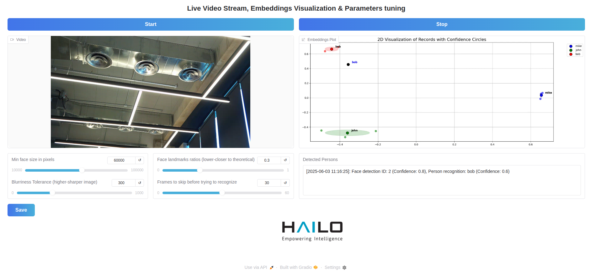
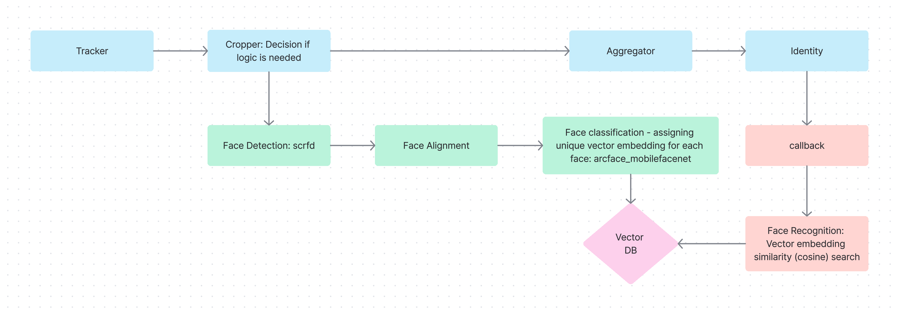

# Face Recognition System

This project is a face recognition system built using:

1. Python - Application code (image post-processing in C++)
2. GStreamer - Real-time video processing pipeline
3. LanceDB - Embeddings database (stored in a file)
4. Gradio - Web UI framework for AI applications
5. FastRTC - Real-time communication streaming GStreamer video into Gradio's interactive web UI
6. FiftyOne - Dataset inspection and analysis

This project is moderately advanced and is recommended for use after gaining some experience with the "Basic Pipelines."

The system supports real-time face recognition using GStreamer pipelines and the Hailo neural network AI accelerator.

It can train the known persons' catalog from a provided directory with images of persons (train mode below).

The information is managed in a local ("on a file") database optimized for storing and indexing AI embeddings, called LanceDB. This is a significant improvement over the commonly used static string-based files, such as JSON.

The system provides an optional web interface, powered by the well-known FiftyOne platform (Python package installation required), for managing face recognition data, including visualizing embeddings and adding, updating, or deleting persons and their associated images. The web interface runs on localhost and interacts with the local LanceDB database.

In addition, the db_handler.py module provides a custom API for interactions with the LanceDB database for fine-grained DB management.

One of the key features of the system is the --mode run with the --visualize flag, which provides a live display of the current catalog as 2D embeddings. With every new face recognition, the system adds it as a 2D embedding to the display, offering natural visibility into the recognition process and an intuitive understanding of why a face was recognized as someone or not. Please note that in the current implementation, only recognized faces (e.g., pre-trained - those that appear in the database) are plotted; specifically, unrecognized faces are not plotted.

For demonstration purposes, the current application demonstrates sending Telegram notifications via a bot when a person (either recognized or unknown) is detected. To enable this feature, the Telebot package is required but not installed by default, so you need to install it separately. Please note that a bot token and chat ID must be provided. In their absence, the function will simply do nothing. Please refer to Telegram guides on how to set up a bot.

Below is an example of the face recognition system in action:



This image demonstrates the live visualization of embeddings during the recognition process, showcasing how the system identifies and maps faces in real-time.

For each face detection, there is a confidence level, followed by another confidence level for the recognition itself - in case the face was recognized as someone from the database.

Face recognition confidence is per person record in the database, initiated with a default value (0.3) and can be manually modified either via the FiftyOne web interface or the db_handler.py API.

### Algorithmic configuration parameters:

For best performance, there is a quality selection mechanism on what frames are good enough to be evaluated and searched for face classification. The parameters are read from:

[/hailo-apps-infra/resources/json/face_recon_algo_params.json](../hailo-apps-infra/resources/json/face_recon_algo_params.json)

and are also tunable via UI sliders (don't forget to save the selection).

In other words - each frame should pass those image-wise quality thresholds in order to continue the evaluation flow (search in the LanceDB etc.).

The parameters are:
Min face size in pixels: The face size in pixels as resulted from the face detection must be prominent (large) enough within the frame. E.g., if a person stands too far away from the camera and the face occupies only several pixels - that's not a good input for the face classification system.

Blurriness Tolerance - see method measure_blurriness. Blurry images are also not a good input for the face classification system.

Face landmarks ratios - see method calculate_procrustes_distance. In simple abstract words, practically this ensures the person is front-facing the camera as directly as possible.

Frames to skip before trying to recognize - avoid processing the first frames since usually they are blurry as the person just entered the scene. Please note - from all the parameters, our internal tests revealed this one is the most influential on the overall system performance.

Another parameter appearing in the JSON file but not directly tunable from the UI is the batch size, both for face detection & recognition networks.

Theory Point: What is face recognition algorithm & pipeline
Below is a schematic conceptual oversimplified diagram, just for the sake of basic concept understanding. Blue - Pipeline elements, green - algorithms, orange - logic code.



## Prerequisites

- Python 3.8+
- Pipenv or virtualenv for dependency management
- Required Python libraries (see `requirements.txt`)
- GStreamer installed on the system

## Installation

The application is part of the `hailo-apps-infra` package - please follow those general installation guidelines. Short non-comprehensive process summary:

```
git clone https://github.com/hailo-ai/hailo-apps-infra.git
# cd to the directory
./install.sh  # install all
source hailo_rpi_examples_venv/bin/activate  # activate python virtual enviornment
export DISPLAY=:0  # required only if working on remote Pi with external display
python hailo_apps_infra/hailo_core/hailo_installation/post_install.py  # post installatin procedures
# cd to app directory
python face_recognition.py --mode train  # first populate the DB

python face_recognition.py --input rpi --mode run --ui --visualize  # run option 1 - Gradio web UI
python face_recognition.py --input rpi --mode run --ui  # run option 2 - Gradio UI without visualization

python face_recognition.py --input rpi --mode run --visualize  # run option 3 - CLI
python face_recognition.py --input rpi --mode run  # run option 4 - CLI without visualization

python face_recognition.py --input usb --mode run  # run option 5 - USB camera input, CLI without visualization

python face_recognition.py --mode delete  # clear the DB
```

## Usage

### Face Recognition Options Flow


## Web Interface

   ```bash
   python embedding_visualizer.py
   ```
Open the interface on: http://localhost:5151/ (When executed from an IDE such as VS Code, it will automatically redirect to the browser).

Please refer to the https://voxel51.com/fiftyone/ guide for more details about using the interface.

---

## Telegram Notifications

- Configure the `TELEGRAM_TOKEN` and `TELEGRAM_CHAT_ID` in `app_db.py` to enable Telegram notifications.
- Notifications are sent when a face is detected, with an image and confidence score.

---

## Acknowledgments

- [GStreamer](https://gstreamer.freedesktop.org/)
- [LanceDB](https://lancedb.github.io/)
- [Telegram Bot API](https://core.telegram.org/bots/api)
- [Voxel51](https://voxel51.com/fiftyone/)
- [Gradio](https://www.gradio.app/)
- [FastRTC](https://fastrtc.org/)

## Appendix: Brief Explanation of the Code Architecture and Design

The application is under: [/hailo-apps-infra/hailo_apps_infra/hailo_apps/apps/face_recognition](../hailo_apps_infra/hailo_apps/apps/face_recognition)

The pipeline is under: [hailo-apps-infra/hailo_apps_infra/hailo_apps/hailo_pipelines](../hailo_apps_infra/hailo_apps/hailo_pipelines)

Additional files are under: [/hailo-apps-infra/hailo_apps_infra/hailo_core/hailo_common](../hailo_apps_infra/hailo_core/hailo_common)

The entry point is `face_recognition.py`. In case of Gradio UI interface, the web interface will be launched in a separate thread.

On the next step, the GStreamer pipeline will start.

If embedding visualization is enabled via the `--visualize` parameter, a separate process will be launched for that. The basic operation is that the pipeline prepares the plot, puts it in a queue, and the separate process will access that queue and pull from there for actual display. In case of Gradio web interface, this happens in `face_ui_callbacks.py`.

Regarding video display in case of Gradio web interface, the mechanism is GStreamer appsink, via the `appsink_callback` method in `gstreamer_app.py`. The operation is that frames are put into `webrtc_frames_queue` and the UI mechanism with WebRTC built into Gradio pulls frames for display streaming (see `base_ui_callbacks.py`).

A key part of the pipeline is the identity callback method `vector_db_callback` that is called at the end of the pipeline. This is where the main application-specific logic is performed: Frame quality is evaluated, the face is searched in the LanceDB for classification, and track ID logic is added - avoiding re-processing recognized faces.

The logic is that if a face was recognized - we plot the embedding & avoid re-processing it. On the other hand, if a face was not recognized, we will repeat trying to recognize it after some delay (see skip_frames).

`train_vector_db_callback` is a simplified version of the callback, used in --mode train at the beginning, when the database is populated with known faces.