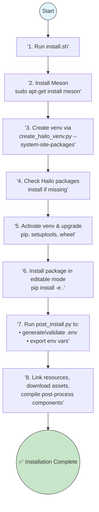

# Installation Guide

## Table of Contents

- [Installation Guide](#installation-guide)
  - [Table of Contents](#table-of-contents)
  - [Prerequisites](#prerequisites)
  - [Installation Options](#installation-options)
    - [Option 1: Quick Start (Recommended)](#option-1-quick-start-recommended)
    - [Option 2: Install as a Python Package](#option-2-install-as-a-python-package)
    - [Option 3: Manual Installation](#option-3-manual-installation)
  - [Configuration](#configuration)
  - [Verification](#verification)
  - [Uninstallation](#uninstallation)
  - [Installation Flow Diagram](#installation-flow-diagram)

---

## Prerequisites

Before you begin, ensure you have the following:

* **Operating System:**

  * Ubuntu 20.04 or later (recommended)
  * Any Linux distribution with the `apt` package manager
* **Languages & Runtimes:**

  * Python 3.10 or 3.11
* **Package Managers:**

  * `pip`
  * `apt`
* **Hardware Requirements:**

  * Hailo8 or Hailo10 device on x86 or Raspberry Pi
* **System Packages:**

  * `meson` (build system)
  * `git`
  * `python3-venv`

---

## Installation Options

Choose the method that best fits your needs.

### Option 1: Quick Start (Recommended)

Our automated script handles everything for you:

```bash
# Run the installer
./install.sh

# Download all available models
./install.sh --all

# Use a custom virtual environment name
./install.sh --venv-name my_custom_env
```

The script will:

1. Create a Python virtual environment
2. Install dependencies
3. Download required model files
4. Configure your environment

### Option 2: Install as a Python Package

Install directly from GitHub:

```bash
pip install git+https://github.com/hailo-ai/hailo-apps-infra.git
hailo-post-install
```

### Option 3: Manual Installation

If you need full control or are troubleshooting:

1. **Create & activate a virtual environment**

   ```bash
   python3 -m venv your_venv_name --system-site-packages
   source your_venv_name/bin/activate
   ```
2. **Check for Hailo packages**

   ```bash
   pip list | grep hailo
   ```
3. **If missing, install Hailo Python packages**

   ```bash
   ./scripts/hailo_python_installation.sh
   ```
4. **Upgrade pip and install dependencies**

   ```bash
   pip install --upgrade pip setuptools wheel
   ```
5. **Install the repository in editable mode**

   ```bash
   pip install -e .
   ```
6. **Run the post-install setup**

   ```bash
   hailo-post-install
   ```

---

## Configuration

| Flag                  | Description                               | Example                        |
| --------------------- | ----------------------------------------- | ------------------------------ |
| `--all`               | Download every available model resource   | `./install.sh --all`           |
| `--venv-name` or `-n` | Specify a custom virtual environment name | `./install.sh --venv-name env` |

---

## Verification

Make sure everything is installed correctly:

1. **Activate your environment**

   ```bash
   source hailo_infra_venv/bin/activate
   ```
2. **Check installed Hailo packages**

   ```bash
   pip list | grep hailo
   ```

   You should see packages like `hailort`, `hailo-tappas-core`, and `hailo-apps-infra`.
3. **Verify the Hailo device connection**

   ```bash
   hailortcli fw-control identify
   ```
4. **Run a demo detection**

   ```bash
   hailo-detect
   ```

   A video window with live detections should appear.

---

## Uninstallation

To remove everything:

```bash
# Deactivate the virtual environment if active
deactivate

# Delete project files and logs
sudo rm -rf hailo_infra_venv/ resources hailort.log .env hailo_apps_infra.egg-info
```

---

## Installation Flow Diagram


