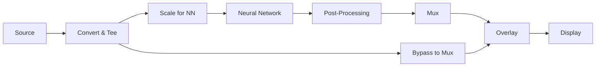
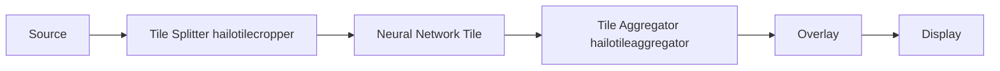
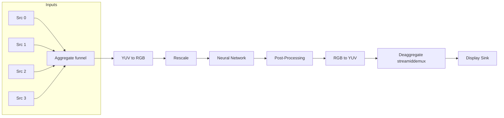
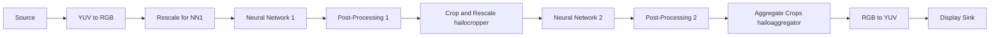
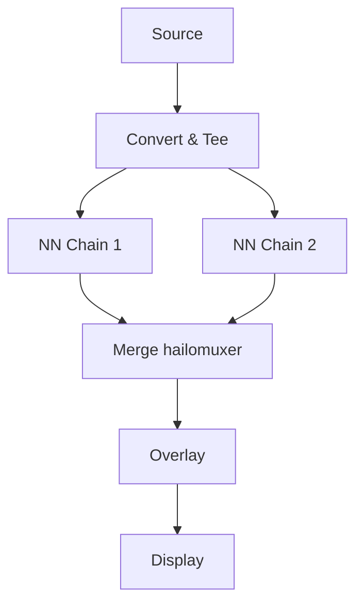
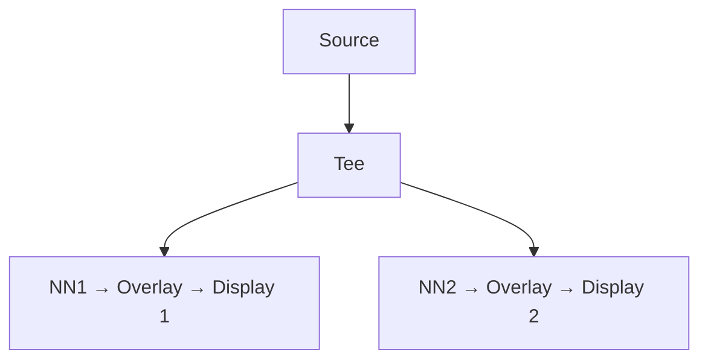

# Hailo GStreamer Pipeline Guide

---

## 1. Single Network Pipeline

The simplest pipeline runs a single AI model on incoming video frames and displays the results.


**Example Command:**

```sh
gst-launch-1.0 \
  filesrc location=$VIDEO_DEVICE ! decodebin ! videoconvert ! \
  videoscale ! queue leaky=no max-size-buffers=30 ! \
  hailonet hef-path=$HEF_PATH is-active=true ! \
  queue leaky=no max-size-buffers=30 ! \
  hailofilter function-name=$POSTPROC_FUNC so-path=$POSTPROC_SO qos=false ! \
  queue leaky=no max-size-buffers=30 ! hailooverlay ! \
  videoconvert ! fpsdisplaysink video-sink=xvimagesink sync=true text-overlay=false
```

**Key Steps:**

1. **Decode & Convert**: Read and convert frames into a standard format.
2. **Scale**: Adjust resolution to match network input.
3. **Inference**: Run the model on Hailo hardware.
4. **Post-Process**: Extract detections.
5. **Overlay & Display**: Draw results and show the video.

---

## 2. Single Network with Resolution Preservation

Extends the basic pipeline to preserve the original frame resolution while running inference on a scaled copy.



**Example Command:**

```sh
gst-launch-1.0 \
  $SOURCE_ELEMENT ! videoconvert ! tee name=t hailomuxer name=mux \
  t. ! queue leaky=no max-size-buffers=30 ! mux. \
  t. ! videoscale ! queue leaky=no max-size-buffers=30 ! \
    hailonet hef-path=$HEF_PATH is-active=true ! \
    queue leaky=no max-size-buffers=30 ! \
    hailofilter function-name=$NETWORK_NAME so-path=$POSTPROC_SO qos=false ! mux. \
  mux. ! queue leaky=no max-size-buffers=30 ! hailooverlay ! \
  queue leaky=no max-size-buffers=30 ! videoconvert ! \
  fpsdisplaysink video-sink=$VIDEO_SINK sync=$SYNC text-overlay=false
```

---

## 3. Single Network with Tiling

Splits each frame into tiles, runs inference on each tile, then recombines them.



**Notes:**

* **hailotilecropper** splits the frame into a grid of tiles.
* **hailotileaggregator** stitches annotated tiles back to full resolution.

---

## 4. Multi-Stream Pipeline

Serializes multiple video sources over one Hailo device, then de-serializes for display.



**Key Elements:**

* **funnel**: Combines multiple streams into one with IDs.
* **streamiddemux**: Splits back into separate outputs.

---

## 5. Cascaded Networks Pipeline

Runs two networks in series: first detects on the full frame, then crops and refines each detection.



**Workflow:**

1. Detect coarse objects.
2. Crop and resize detections.
3. Refine with second network.
4. Overlay all results on the original frame.

---

## 6. Parallel Networks Pipeline

Runs two networks on the same frame in parallel, then merges or splits outputs.

### 6.1 Single Display

Merges both network outputs into one view.



### 6.2 Dual Displays

Each network output goes to its own display.



**Tip:** Use GStreamer’s `tee` element to fork the stream and run multiple inference branches.

---

With these templates you can swap in different HEF files, post-process libraries, and display sinks to build your own custom pipelines. 

#### Happy building!
